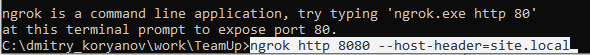
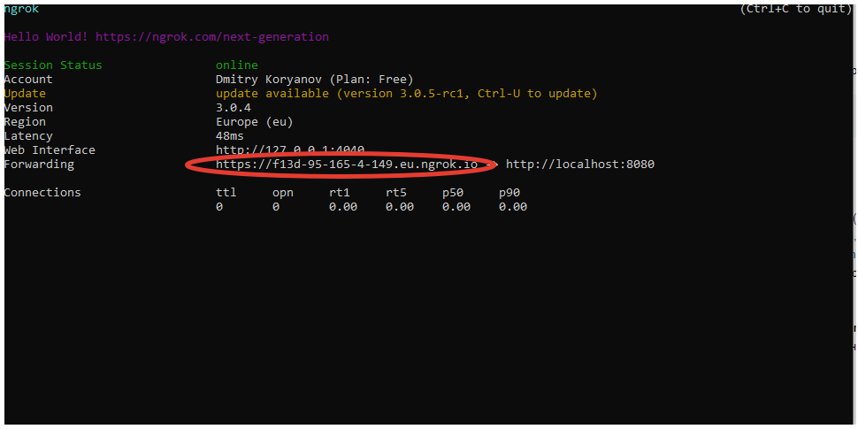

# PokerPlanningRusBot

---
## Перед запуском приложения 

Для запуска базы данных (Redis) в Docker выполните в терминале IDEA:

    docker-compose up -d

## Настройка телеграм бота

1. В properties необходимо указать корректных webhook (см. п.3) (**telegram.webhookPath**)
2. Необходимо указать этот же webhook для телеграмма, выполнив команду 
https://api.telegram.org/bot<telegram.botToken>/setWebhook?url=<telegram.webhookPath>
3. Как получить webhook локально на компьютере (для тестирования, разработки - при запуске 
приложения из идеи): 
      * Скачиваем ngrok (https://ngrok.com/download).
      * Запускаем ngrok (приложение может быть заблокировано антивирусом -> в таком случае необходимо 
   добавить его в исключения)
      * Выполняем команду **ngrok** **http 8080 --host-header=site.local** в ngrok (**8080** - порт 
   приложения по умолчанию, если в настройках явно указан **server.port** - указываем его)
   
      * Получаем картинку вида
   
      * В строке Forwarding наш webhook, который, как было сказано выше, необходимо прописать в 
   application.properties и уведомить телеграм о нём, выполнив команду setWebhook 
## Аккаунты администраторов:

Инициализируется при запуске приложения, прописаны в application.properties 
(**telegram.admins**). В дальнейшем в боте список администраторов можно менять.

---

